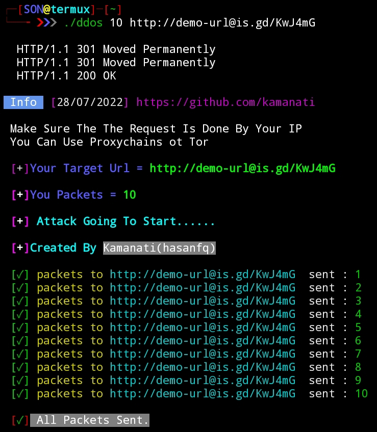
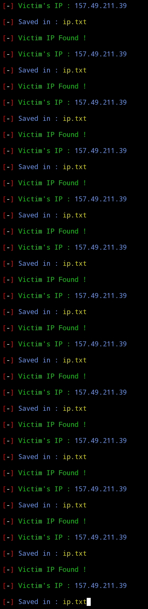

# ddos
Simple tool to perform ddos attack with both IP and by URL  multi attack is enabled 

## Data Used 
```
1 Packets = 128kb

2000 Packets = 10MP

1 Trillion Packets = 100MP - 170MP
```
**Features**
 ```
  Speed = 0.97/Packets

  No One Can Stop The Sending Packets Expect User
  Even Owner Can Also Can't Stop 
  Until Victim Block Your Ip 
```

### Installation

- Just, Clone this repository -
```
$ git clone https://github.com/Kamanati/ddos
$ cd ddos
$ chmod +x *
$ ./ddos [number of packets] [URL or IP]

```

**Example**

 Example               |  My Host               
:-------------------------:|:-------------------------:  
  |  


